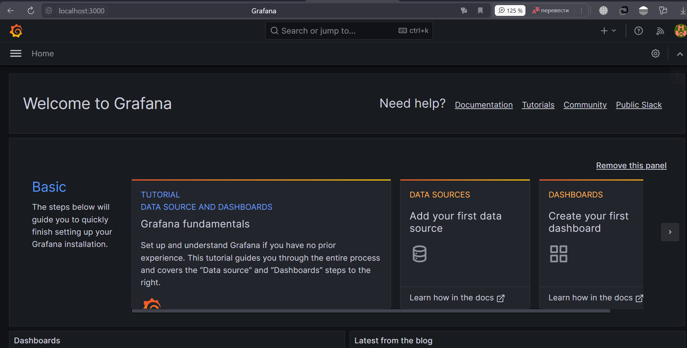
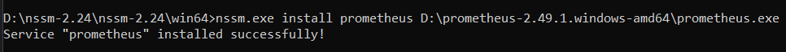

# GB-Spring
## Урок 11. Spring Actuator. Настройка мониторинга с Prometheus и Grafana.
Задание: Используйте Spring Actuator для отслеживания метрик вашего приложения. 
Настройте визуализацию этих метрик с использованием Prometheus и Grafana.

1. Устанавливаем "Grafana". Работает на порту 3000
    
2. Устанавливаем "Prometheus" через ""nssm". Работает на порту
   